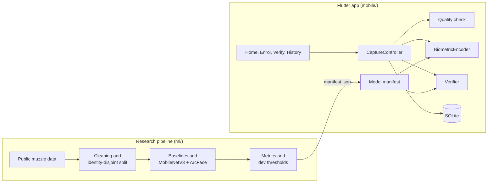

# PostMortemID

**Initial software product demonstration** for the ALU BSc. Software Engineering capstone (Machine Learning specialisation).

Research title: *PostMortemID: Evaluating Muzzle Identity Persistence from Ante-Mortem to Post-Mortem Smartphone Imagery in Rwandan Cattle*

PostMortemID investigates whether the ridge and bead pattern on a cow's muzzle, photographed with an ordinary smartphone while the animal is alive, still verifies the same animal after slaughter. The planned study photographs the same cattle at a Rwandan abattoir before and shortly after routine slaughter, and measures 1:1 verification performance across that change, with the face as a comparator.

This repository contains the first working version of the software for that study: an offline Flutter app for guided capture, quality checks, enrolment and verification, and a reproducible Python pipeline with a model notebook. The model work so far uses a **public dataset of live cattle**. No post-mortem images have been collected yet, so nothing here measures post-mortem performance.

## What is implemented

**Mobile prototype (Flutter, Android, fully offline)**

- Register a study animal (`PM-0001` style code, optional ear tag or facility record, identity-link status)
- Guided camera capture with a square muzzle guide, or import from the gallery
- Quality check for image size, brightness and sharpness, with plain-language retake messages
- Enrolment: a template from 3 accepted live (T0) images
- Verification of a query image against a claimed animal, at time point T0, P0 or P1
- Match / Review / No match decision from two thresholds, with the score, thresholds and versions shown
- History of all results in local SQLite, each traceable to model, threshold and app versions
- Clear labelling that the current encoder is a demonstration encoder, not the research model

**Research pipeline (Python, `uv`)**

- Download with hash check, duplicate-identity screening by camera-frame provenance, near-duplicate removal
- Identity-disjoint train / dev / test split with leakage checks
- Five verification models: SIFT, LBP, frozen ImageNet MobileNetV3-Large, and MobileNetV3-Large trained with softmax and with ArcFace
- Thresholds set on dev animals, metrics on test animals, bootstrap confidence intervals over animals
- Export of encoder settings and thresholds to the app, with a test that checks Python and Dart compute the same features

## Screenshots

| Home | Enrolment | Verification | Match | No match | History |
|---|---|---|---|---|---|
|  |  |  |  |  |  |

Screenshots are from the Android emulator using test-split images that were not used for training or thresholds.

## Architecture



The app loads a manifest exported by the pipeline that names the encoder, its settings, the thresholds and the quality limits. `BiometricEncoder` is an interface. Today it is implemented by an LBP texture encoder in plain Dart. The trained MobileNetV3 model will be exported to TensorFlow Lite and added as a second implementation, without changes to the screens or storage. See [docs/architecture.md](docs/architecture.md).

## Repository structure

```
.
├── pyproject.toml, uv.lock     Python project and locked dependencies
├── ml/
│   ├── src/postmortemid/        data cleaning, splits, models, training, metrics, verification
│   ├── notebooks/               01_e0_public_baseline.ipynb, the model notebook
│   ├── scripts/                 download, prepare, export manifest, parity fixture, demo images
│   ├── configs/e0.json          every setting used by the experiment
│   ├── data/splits/             versioned split and cleaning files (no images)
│   ├── experiments/             experiment log and results JSON
│   └── tests/                   pytest
├── mobile/                      Flutter app (lib/, test/, assets/model/manifest.json)
└── docs/                        architecture, model, dataset, experiment plan, figures, screenshots
```

## Setup

Requirements: [uv](https://docs.astral.sh/uv/) 0.5 or newer, Flutter 3.44 (stable, Dart 3.12), Android SDK with an emulator or an Android phone. About 1.5 GB of disk for the dataset and environment.

```bash
git clone <repository-url>
cd postmortemid
uv sync
```

`uv sync` installs Python 3.12 and every dependency from `uv.lock`.

## Running the ML notebook

```bash
uv run python ml/scripts/download_dataset.py
uv run jupyter lab ml/notebooks/01_e0_public_baseline.ipynb
```

The download is about 644 MB from Zenodo and is checked against its SHA-256. In JupyterLab use *Kernel > Restart Kernel and Run All Cells*. The notebook rebuilds the cleaned split itself and takes about 20 minutes on an Apple M-series laptop, most of it the two training runs. It uses a CUDA GPU if present, otherwise Apple MPS, otherwise CPU (slower).

To run it without opening JupyterLab:

```bash
uv run jupyter nbconvert --to notebook --execute --inplace ml/notebooks/01_e0_public_baseline.ipynb
```

After a run, update the app manifest from the new results:

```bash
uv run python ml/scripts/export_app_manifest.py
```

Checks:

```bash
uv run pytest
uv run ruff check ml
uv run pyright
```

## Running the mobile application

```bash
cd mobile
flutter pub get
flutter run
```

To have demo images on the emulator (test-split animals only, plus one blurred and one small image for the quality check):

```bash
uv run python ml/scripts/export_demo_images.py
adb push ml/data/demo /sdcard/Pictures/PostMortemID-demo
```

Checks:

```bash
cd mobile
flutter analyze
flutter test
```

## Initial results

Experiment E0, public live-cattle data only. 52 test animals never used for training or thresholds; 3 enrolment images per animal in capture order; 454 genuine and 22,700 impostor comparisons; thresholds fixed on 52 dev animals; 95% bootstrap intervals over animals.

| Model | ROC-AUC | EER [95% CI] | TAR at dev FAR 1% threshold [95% CI] | Realised test FAR |
|---|---|---|---|---|
| SIFT matching | 0.968 | 7.7% [3.8, 10.2] | 75.1% [61.6, 87.1] | 0.18% |
| LBP (runs in the app today) | 0.936 | 11.2% [6.3, 16.4] | 78.4% [69.2, 86.8] | 0.50% |
| MobileNetV3-Large, ImageNet, no training | 0.968 | 6.6% [3.6, 10.2] | 88.5% [82.1, 94.1] | 0.50% |
| MobileNetV3-Large, softmax | 0.993 | 2.5% [0.9, 5.7] | 95.6% [91.3, 99.0] | 0.89% |
| **MobileNetV3-Large, ArcFace (proposed)** | **0.994** | **2.2% [0.7, 5.5]** | **96.5% [92.5, 99.5]** | 0.87% |

What these numbers mean:

- Fine-tuning MobileNetV3-Large on 157 public animals cuts the EER to about a third of the pretrained baseline. ArcFace and softmax are not separated at this sample size.
- Dev thresholds held on test animals at the 1% target. At the 0.1% target they overshot slightly (0.17% for ArcFace), and that operating point rests on very few impostor scores.
- Open-set rejection is only 64.8% for ArcFace at the 1% threshold, because false accepts add up across a gallery.
- These are **live-to-live** results from one US herd photographed in one session. They are a reference point, not evidence that the muzzle identifies animals after death.

Two independent full runs gave identical numbers. Details, figures and error analysis are in the notebook and [ml/experiments/README.md](ml/experiments/README.md).


## Deployment plan

1. **Now: local offline prototype.** The Flutter app runs on Android with no network. Images, templates and results stay in app storage and SQLite. Encoder: LBP demonstration encoder with E0 dev thresholds.
2. **Next: on-device research model.** Export the MobileNetV3-Large ArcFace model to TensorFlow Lite with reduced-precision weights, add it as a second `BiometricEncoder`, and ship it with a new manifest. Measure model size, inference time and agreement with desktop scores on both study phones.
3. **Detector.** Label muzzle and face boxes on pilot images and train a small YOLO detector, so the app crops the biometric region instead of using the centre square.
4. **Optional synchronisation.** A small FastAPI and PostgreSQL service to collect records from the study phones and serve new model versions, only if the field study needs it. The app must keep working offline.
5. **Research validation.** After ethics clearance and a facility agreement: pilot, then paired live and post-mortem capture, and experiments E1 to E7 on held-out animals. Thresholds will be set again on the study data.

The prototype will not be deployed to insurers or farmers during this study.

## Limitations

Demonstrated:

- the full offline capture, quality check, enrolment, verification and history workflow on Android
- a leakage-controlled live-to-live evaluation on public data with measured, reproducible metrics
- that the phone computes the same features as the research pipeline

Not demonstrated:

- any post-mortem result. No post-mortem images exist yet.
- the face comparator, cross-phone effects or time since slaughter
- performance on Rwandan cattle or smartphone images
- the research model running on the phone; the app uses the weaker LBP demonstration encoder
- automatic muzzle detection
- suitability for insurance, traceability or any operational decision

The duplicate-identity cleaning found 7 of the 19 duplicates reported by BC et al. (2026), whose list was not available. The quality limits are starting values from public images and need checking on pilot images.

## Research alignment

| Proposal | This repository |
|---|---|
| Muzzle as primary biometric, verification at fixed FAR | Muzzle pipeline, TAR at dev-calibrated FAR 1% and 0.1%, EER, ROC/DET |
| Identity-disjoint evaluation, leakage control | Animal-level split, duplicate and near-duplicate screening, thresholds from dev only |
| Baselines: SIFT, generic features, softmax MobileNetV3 | SIFT, frozen ImageNet MobileNetV3 and softmax MobileNetV3 run. DINOv2 is planned for the pilot sanity check |
| MobileNetV3-Large + ArcFace, k-image templates, cosine similarity | Implemented and trained on public data; k = 1, 3, 5 reported |
| Match / Review / No match from tau(FAR 1%) and tau(FAR 0.1%) | Implemented in Python and in the app |
| Offline Flutter app, SQLite, model versioning (FR1 to FR7, NFR5 to NFR8) | Implemented; export (FR3) and sync (FR8) are later increments |
| E0 public-data baseline | Done |
| E1 to E7 paired experiments | Planned, need field data |

## Data and licences

The muzzle images are from Xiong, Li and Erickson (2022), *Beef Cattle Muzzle/Noseprint database for individual identification*, Zenodo, [doi:10.5281/zenodo.6324361](https://doi.org/10.5281/zenodo.6324361), licensed CC BY 4.0. They are downloaded by the setup script and are not stored in this repository. See [docs/dataset.md](docs/dataset.md).

## Documentation

- [docs/architecture.md](docs/architecture.md): app layers, inference seam, storage, pipeline
- [docs/model.md](docs/model.md): biometric input, embedding model, thresholds, versioning
- [docs/dataset.md](docs/dataset.md): source, licence, cleaning, split
- [docs/experiment-plan.md](docs/experiment-plan.md): E0 protocol and planned experiments

## Repository link

The GitHub URL will be added here once the repository is published.
