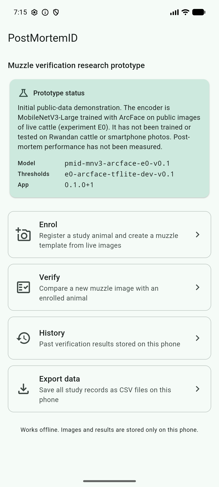
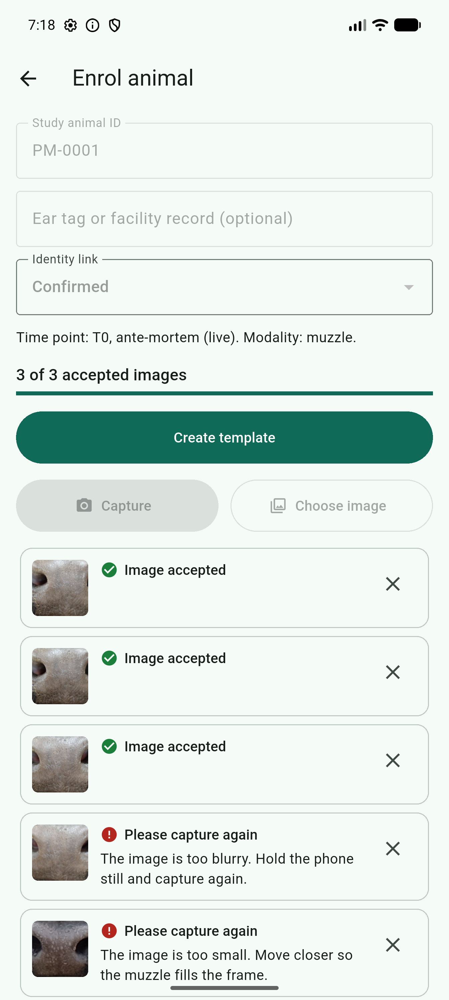
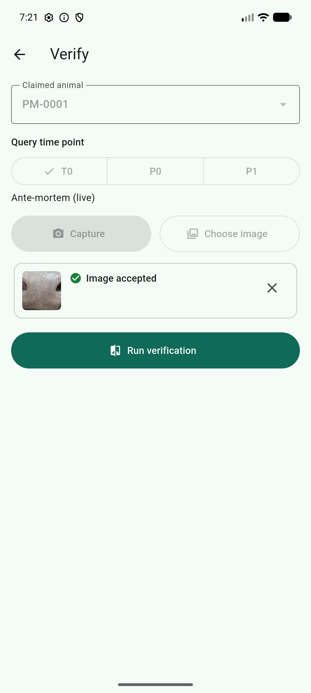
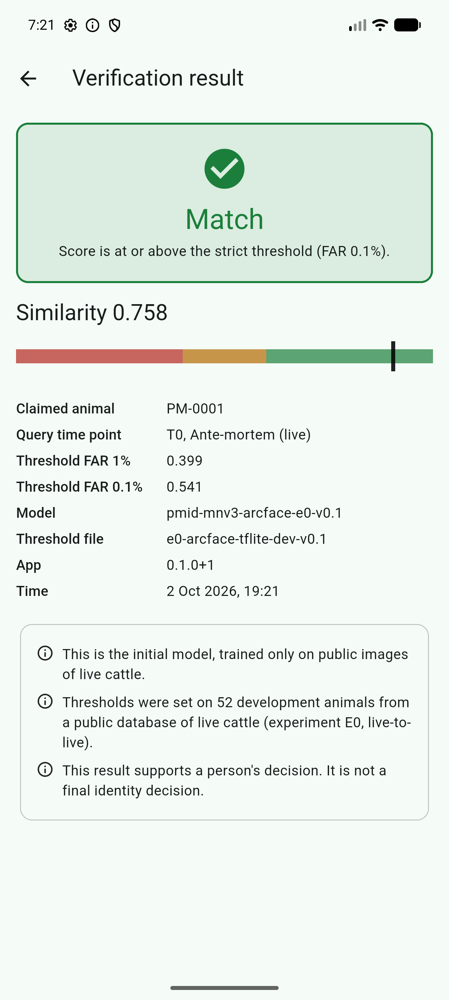
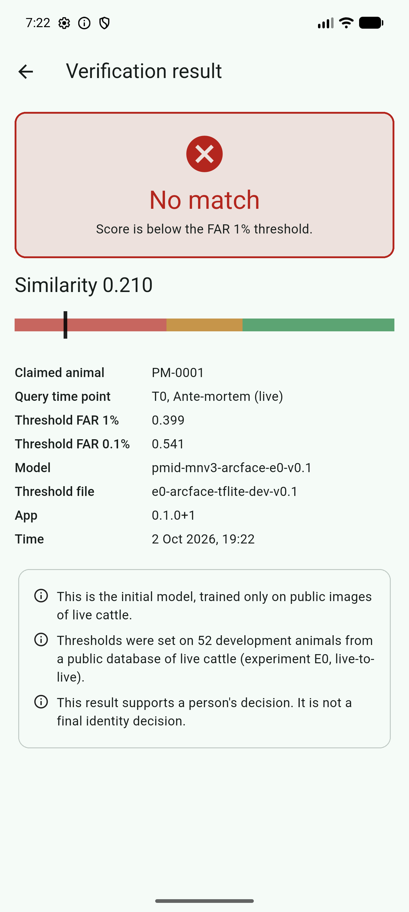
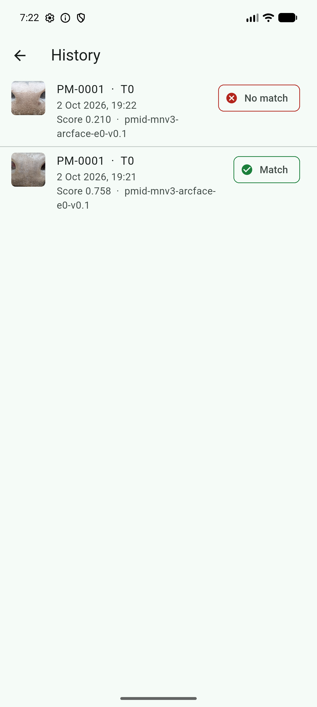
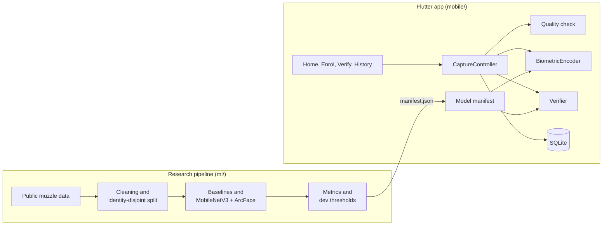
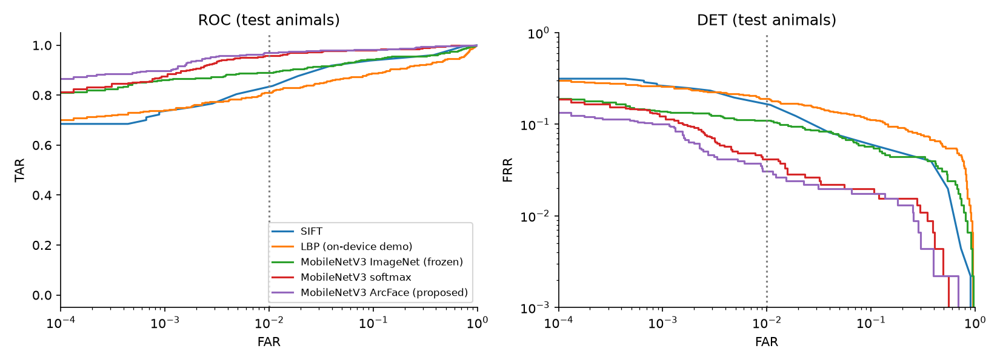

# PostMortemID

**Initial software product demonstration** for the ALU BSc. Software Engineering capstone (Machine Learning specialisation).

Research title: *PostMortemID: Evaluating Muzzle Identity Persistence from Ante-Mortem to Post-Mortem Smartphone Imagery in Rwandan Cattle*

PostMortemID investigates whether the ridge and bead pattern on a cow's muzzle, photographed with an ordinary smartphone while the animal is alive, still verifies the same animal after slaughter. The planned study photographs the same cattle at a Rwandan abattoir before and shortly after routine slaughter, and measures 1:1 verification performance across that change, with the face as a comparator.

This repository contains the first working version of the software for that study: an offline Flutter app for guided capture, quality checks, enrolment and verification, and a reproducible Python pipeline with a model notebook. The model work so far uses a **public dataset of live cattle**. No post-mortem images have been collected yet, so nothing here measures post-mortem performance.

## What is implemented

**Mobile prototype (Flutter, Android, fully offline)**

- Register a study animal (`PM-0001` style code, optional ear tag or facility record, identity-link status)
- Guided camera capture with a square muzzle guide, or import from the gallery
- Quality check for image size, brightness and sharpness, with plain-language retake messages
- Enrolment: a template from 3 accepted live (T0) images
- Verification of a query image against a claimed animal, at time point T0, P0 or P1
- Match / Review / No match decision from two thresholds, with the score, thresholds and versions shown
- History of all results in local SQLite, each traceable to model, threshold and app versions
- Each image is recorded in the database before it is analysed, so a crash does not lose a capture
- Export of all study records as CSV files on the phone (ear tags are left out)
- The trained MobileNetV3-Large ArcFace model runs on the phone with TensorFlow Lite (LiteRT), fully offline; an LBP texture encoder is kept as a fallback
- Clear labelling that the model was trained on public live-cattle images only and that post-mortem use has not been measured

**Research pipeline (Python, `uv`)**

- Download with hash check, duplicate-identity screening by camera-frame provenance, near-duplicate removal
- Identity-disjoint train / dev / test split with leakage checks
- Five verification models: SIFT, LBP, frozen ImageNet MobileNetV3-Large, and MobileNetV3-Large trained with softmax and with ArcFace
- Thresholds set on dev animals, metrics on test animals, bootstrap confidence intervals that resample animals on both sides of every comparison
- TFLite export with thresholds re-set on dev animals using the exact phone preprocessing, plus tests that check Python and Dart compute the same inputs and features

## Screenshots

| Home | Enrolment | Verification | Match | No match | History |
|---|---|---|---|---|---|
|  |  |  |  |  |  |

Screenshots are from a release build on the Android emulator, using test-split images that were not used for training or thresholds. The muzzle images shown are from the public dataset (CC BY 4.0, see [Data and licences](#data-and-licences)).

## Architecture



The app loads a manifest exported by the pipeline that names the encoder, its model file, the thresholds and the quality limits. `BiometricEncoder` is an interface with two implementations: `TfliteEncoder` runs the exported MobileNetV3-Large ArcFace model, and `LbpEncoder` is a plain-Dart fallback. Changing the model is a manifest and asset change; screens and storage stay the same. See [docs/architecture.md](docs/architecture.md).

## Repository structure

```
.
├── pyproject.toml, uv.lock     Python project and locked dependencies
├── ml/
│   ├── src/postmortemid/        data cleaning, splits, models, training, metrics, verification
│   ├── notebooks/               01_e0_public_baseline.ipynb, the model notebook
│   ├── scripts/                 download, prepare, export manifest, parity fixture, demo images
│   ├── configs/e0.json          every setting used by the experiment
│   ├── data/splits/             versioned split and cleaning files (no images)
│   ├── experiments/             experiment log and results JSON
│   └── tests/                   pytest
├── mobile/                      Flutter app (lib/, test/, assets/model/manifest.json)
└── docs/                        architecture, model, dataset, experiment plan, figures, screenshots
```

## Setup

Requirements:

- [uv](https://docs.astral.sh/uv/) 0.5 or newer (it installs Python 3.12)
- Flutter 3.44 (stable, Dart 3.12) with the Android SDK, JDK 17 (bundled with Android Studio) and an Android emulator image or an Android phone
- About 6 GB of free disk: dataset download and unpacked images 1.2 GB, Python environment 1.2 GB, image cache 0.7 GB, Flutter build 1.6 GB, and about 1 GB more if you rebuild the phone model
- About 30 minutes for the first full run: download, `uv sync` and the notebook

```bash
git clone <repository-url>
cd postmortemid
uv sync
```

`uv sync` installs Python 3.12 and every dependency from `uv.lock`.

## Running the ML notebook

```bash
uv run python ml/scripts/download_dataset.py
uv run jupyter lab ml/notebooks/01_e0_public_baseline.ipynb
```

The download is about 644 MB from Zenodo and is checked against its SHA-256. In JupyterLab use *Kernel > Restart Kernel and Run All Cells*. The notebook rebuilds the cleaned split itself and takes about 20 minutes on an Apple M-series laptop, most of it the two training runs. It uses a CUDA GPU if present, otherwise Apple MPS, otherwise CPU (slower).

To run it without opening JupyterLab:

```bash
uv run jupyter nbconvert --to notebook --execute --inplace ml/notebooks/01_e0_public_baseline.ipynb
```

The trained phone model is already in `mobile/assets/model/`. To rebuild it from scratch:

```bash
uv run python ml/scripts/train_arcface.py         # retrains E0 ArcFace, checks it equals the notebook, saves weights
uv run --script ml/scripts/export_tflite.py       # converts to TFLite in its own pinned environment, re-sets dev thresholds
uv run python ml/scripts/export_app_manifest.py   # writes the app manifest (add --encoder lbp for the fallback)
```

`export_tflite.py` runs in a separate environment because the converter (litert-torch 0.9.4) needs PyTorch below 2.14. The first run downloads about 1 GB of converter dependencies.

Checks:

```bash
uv run pytest
uv run ruff check ml
uv run pyright
```

## Running the mobile application

```bash
cd mobile
flutter pub get
flutter run
```

To have demo images on the emulator (test-split animals only, plus one blurred and one small image for the quality check):

```bash
uv run python ml/scripts/export_demo_images.py
adb push ml/data/demo/albums/. /sdcard/Pictures/
adb shell content call --method scan_volume --uri content://media --arg external_primary
```

Each role gets its own album (`PMID-A1-enrol`, `PMID-A1-query`, ..., `PMID-quality`). The Android photo picker shows thumbnails without file names, so `ml/data/demo/contact_sheet.png` maps each thumbnail to its name. In the picker, open *Collections > From this device*, choose the album, tap the photo, then *Done*.

To copy an export off the phone: `adb pull /sdcard/Android/data/rw.alu.postmortemid.postmortemid/files/exports`.

Checks:

```bash
cd mobile
flutter analyze
flutter test
flutter test integration_test    # needs a running emulator or phone; reinstalls the app; checks on-device model output and timing
```

## Initial results

Experiment E0, public live-cattle data only. 52 test animals never used for training or thresholds; 3 enrolment images per animal in capture order; 454 genuine and 22,700 impostor comparisons; thresholds fixed on 52 dev animals. 95% bootstrap intervals with 2,000 resamples of animals, where both animals of an impostor comparison are resampled (subsets bootstrap, Bolle, Ratha and Pankanti, 2004).

| Model | ROC-AUC | EER [95% CI] | TAR at dev FAR 1% threshold [95% CI] | Realised test FAR [95% CI] |
|---|---|---|---|---|
| SIFT matching (sampled impostors, see note) | 0.968 | 7.7% [3.3, 10.5] | 75.1% [60.9, 87.0] | 0.18% [0.00, 0.59] |
| LBP (app fallback) | 0.936 | 11.2% [6.2, 17.0] | 78.4% [69.2, 86.7] | 0.50% [0.13, 1.12] |
| MobileNetV3-Large, ImageNet, no training | 0.968 | 6.6% [3.6, 10.4] | 88.5% [81.9, 94.1] | 0.50% [0.17, 0.99] |
| MobileNetV3-Large, softmax | 0.993 | 2.5% [0.9, 5.7] | 95.6% [91.3, 98.9] | 0.89% [0.35, 1.67] |
| MobileNetV3-Large, ArcFace (proposed) | 0.994 | 2.2% [0.5, 5.6] | 96.5% [92.4, 99.5] | 0.87% [0.32, 1.72] |

SIFT is scored against 10 randomly sampled impostor animals per query (4,540 impostor comparisons) because exhaustive RANSAC matching is slow, so its ROC-AUC and EER use a different impostor set. TAR and FAR are comparison-level rates: each query image compared once with one template, with images rejected by the quality check not counted. In ISO/IEC 19795-1 terms they are 1 - FNMR and FMR.

What these numbers mean:

- Fine-tuning MobileNetV3-Large on 157 public animals cuts the EER to about a third of the pretrained baseline. ArcFace and softmax are not separated at this sample size.
- Dev thresholds held on test animals at the 1% target, though the upper ends of the intervals for the fine-tuned models reach about 1.7%. At the 0.1% target they overshot slightly (0.17% for ArcFace), and that operating point rests on about 30 dev impostor scores.
- Open-set rejection is only 64.8% for ArcFace at the 1% threshold, because false accepts add up across a gallery.
- More enrolment images help: on the same queries, ArcFace EER is 3.1% with k = 1 and 2.2% with k = 5.
- The numbers depend on how strictly near-duplicate frames are removed: with the model fixed, test EER rises from 2.2% at the chosen cut to 3.9% at a stricter one.
- These are **live-to-live** results on US feedlot cattle, with enrolment and query images that appear to come from the same session. They are a reference point, not evidence that the muzzle identifies animals after death.

Three full notebook runs on the same machine (Apple M-series, MPS, PyTorch 2.14.1) gave identical numbers; results on other hardware may differ slightly. Details, figures and error analysis are in the notebook and [ml/experiments/README.md](ml/experiments/README.md).

**The model on the phone.** The ArcFace model was exported to TensorFlow Lite (14.0 MB, float32) and scored again on the same dev and test animals with the exact resize the app performs. Thresholds for the app were set on dev animals with this pipeline.

| | ROC-AUC | EER | TAR at dev FAR 1% threshold | Realised test FAR | TAR at dev FAR 0.1% | Realised test FAR |
|---|---|---|---|---|---|---|
| ArcFace, TFLite with phone preprocessing | 0.993 | 2.0% | 96.3% | 0.94% | 93.0% | 0.19% |

On the Android emulator, the on-device output matched the laptop's TFLite output (cosine 1.000000 on a fixed test pattern). Model inference took about 35 ms per image, and the whole path the app takes for one 720 x 720 photo (read, decode, quality check, resize, model) about 280 ms; the first call, which starts the interpreter, took about 430 ms. The emulator runs on a fast laptop, so these are not the timings of a low-cost phone; that is measured in the on-device tests of the study. The release APK is 49 MB for arm64 phones.



## Deployment plan

1. **Now: local offline prototype.** The Flutter app runs on Android with no network. Images, templates and results stay in app storage and SQLite, and can be exported as CSV. Encoder: the E0 ArcFace MobileNetV3-Large model in TensorFlow Lite (LiteRT is the current name of TensorFlow Lite; the model format is the same), with thresholds set on E0 dev animals.
2. **Next: on-device tests on the study phones.** Measure inference time on the two low-cost Android phones, try reduced-precision weights and report any change in scores, and replace the model with one trained on the study's development animals.
3. **Detector.** Label muzzle and face boxes on pilot images and train a small YOLO detector, so the app crops the biometric region instead of using the centre square.
4. **Optional synchronisation.** A small FastAPI and PostgreSQL service to collect records from the study phones and serve new model versions, only if the field study needs it. The app must keep working offline.
5. **Research validation.** After ethics clearance and a facility agreement: pilot, then paired live and post-mortem capture, and experiments E1 to E7 on held-out animals. Thresholds will be set again on the study data.

The prototype will not be deployed to insurers or farmers during this study.

## Limitations

Demonstrated:

- the full offline capture, quality check, enrolment, verification and history workflow on Android
- a leakage-controlled live-to-live evaluation on public data with measured, reproducible metrics
- the trained ArcFace model running on the phone, with the same output as on the laptop

Not demonstrated:

- any post-mortem result. No post-mortem images exist yet.
- the face comparator, cross-phone effects or time since slaughter
- performance on Rwandan cattle or smartphone images
- on-device speed on a low-cost phone; timings so far come from an emulator on a laptop
- automatic muzzle detection
- suitability for insurance, traceability or any operational decision

The duplicate-identity screen removed 7 folders. BC et al. (2026) report 19; their list was not available, so the overlap between the two is unknown. The quality limits are starting values from public images and need checking on pilot images; the blur measure also scores pale, unpigmented muzzles low when they are in focus.

## Research alignment

| Proposal | This repository |
|---|---|
| Muzzle as primary biometric, verification at fixed FAR | Muzzle pipeline, TAR at dev-calibrated FAR 1% and 0.1%, EER, ROC/DET |
| Identity-disjoint evaluation, leakage control | Animal-level split, duplicate and near-duplicate screening, thresholds from dev only |
| Baselines: SIFT, DINOv2, softmax MobileNetV3 | SIFT, frozen ImageNet MobileNetV3 and softmax MobileNetV3 run. DINOv2 is replaced by frozen ImageNet features for E0 and planned for the pilot check |
| E0 on the cleaned identity list of BC et al. (2026) | Their list was not available; an own provenance screen is used instead |
| Thresholds from out-of-fold scores on development animals | E0 uses a separate dev split, since the public data have enough animals; out-of-fold thresholds are planned for the paired data |
| 2,000 bootstrap resamples over animals | Done, resampling both animals of each comparison |
| MobileNetV3-Large + ArcFace, k-image templates, cosine similarity | Implemented and trained on public data; k = 1, 3, 5 reported |
| Match / Review / No match from tau(FAR 1%) and tau(FAR 0.1%) | Implemented in Python and in the app |
| On-device inference with TensorFlow Lite | E0 ArcFace model running in the app via LiteRT; output matches the laptop on the emulator; timing on low-cost study phones pending |
| Offline Flutter app, SQLite, model versioning (FR1 to FR8, NFR1 to NFR8) | Done: FR2, FR4 to FR7, NFR5 to NFR8, and CSV export for FR3. Partial: FR1 (square guide, but no bursts and no face framing), FR3 (no burst number, face modality, slaughter time, lighting or muzzle condition fields yet), NFR1 (timed on an emulator only), NFR4 (the optional ear tag is kept in the app database, not in a separate linkage file). FR8 sync is optional and not built. These move to the next increment |
| E0 public-data baseline | Done |
| E1 to E7 paired experiments | Planned, need field data |

## Data and licences

The code is released under the MIT licence (see [LICENSE](LICENSE)).

The muzzle images are from Xiong, Li and Erickson (2022), *Beef Cattle Muzzle/Noseprint database for individual identification*, Zenodo, [doi:10.5281/zenodo.6324361](https://doi.org/10.5281/zenodo.6324361), licensed [CC BY 4.0](https://creativecommons.org/licenses/by/4.0/). The raw images are downloaded by the setup script and are not committed. A few appear, unmodified except for resizing, in the notebook outputs and the app screenshots. The repository adds derived file-level metadata and split labels. See [docs/dataset.md](docs/dataset.md).

## Documentation

- [docs/architecture.md](docs/architecture.md): app layers, inference seam, storage, pipeline
- [docs/model.md](docs/model.md): biometric input, embedding model, thresholds, versioning
- [docs/dataset.md](docs/dataset.md): source, licence, cleaning, split
- [docs/experiment-plan.md](docs/experiment-plan.md): E0 protocol and planned experiments

## Repository link

https://github.com/leny62/postmortemid
