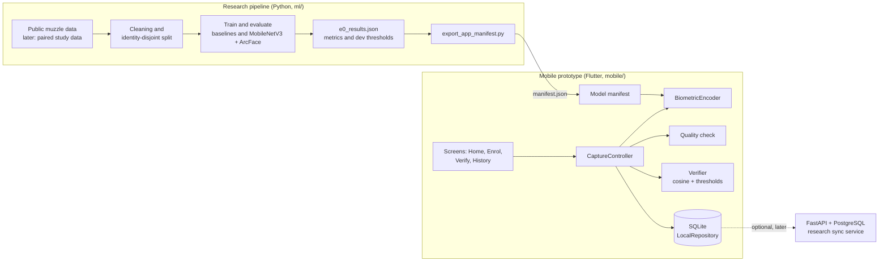

# Architecture

PostMortemID has two parts that share one contract: a Python research pipeline that trains and evaluates models, and an offline Flutter app that uses the exported model and thresholds. This follows Section 3.4 of the research proposal.



## Mobile application

The app runs fully offline on Android. The code is split the same way as the class diagram in the proposal (Figure 6).

| Layer | Code | Responsibility |
|---|---|---|
| Screens | `mobile/lib/ui/` | Home, Enrol, Verify, Result, History and the guided camera screen. They hold no biometric logic. |
| Controller | `mobile/lib/capture/capture_controller.dart` | Runs one capture session: saves the image, checks quality, encodes, then enrols or verifies, and stores each step. |
| Quality check | `mobile/lib/biometrics/quality.dart` | Image size, brightness and sharpness checks with plain-language messages (FR2). |
| Encoder | `mobile/lib/biometrics/biometric_encoder.dart` | Interface that turns an image into an embedding. |
| Verifier | `mobile/lib/biometrics/verifier.dart` | Template averaging, cosine similarity and the Match, Review, No match rule. |
| Storage | `mobile/lib/data/` | SQLite schema and repository. |
| Manifest | `mobile/lib/biometrics/model_manifest.dart` | Loads the encoder settings, thresholds and quality limits exported by the pipeline. |

### Verification path

```
Capture or choose image
  -> copy into app storage and record it (saved before processing, NFR5)
  -> quality check (size, brightness, sharpness); explain and ask for a retake on failure
  -> grayscale, centre square, resize
  -> encode to an L2-normalised embedding
  -> cosine similarity with the claimed animal's template
  -> Match (>= tau FAR 0.1%), Review, or No match (< tau FAR 1%)
  -> save the result with model, threshold and app versions
  -> show decision, score, thresholds and versions
```

Analysis runs in a background isolate so the UI does not freeze while a photo is decoded.

### Inference layer

`BiometricEncoder` is the seam between the app and the model. It has two implementations:

- `TfliteEncoder` runs `pmid-mnv3-arcface-e0-v0.1.tflite`, the MobileNetV3-Large ArcFace model exported by `ml/scripts/export_tflite.py`, through the `flutter_litert` plugin (LiteRT, formerly TensorFlow Lite) on the CPU. ImageNet normalisation is built into the model, so the app only resizes the whole image to 224 x 224 with an antialiased bilinear filter and passes raw RGB values. The interpreter is created inside the analysis isolate from the model bytes, because an interpreter cannot be moved between isolates.
- `LbpEncoder` is a uniform LBP texture descriptor in plain Dart. It is kept as a fallback (`export_app_manifest.py --encoder lbp`) and is not the research model, so its results say so.

The manifest names the encoder type and model file, so switching is a manifest and asset change. Screens, controller and storage do not change (NFR7). Templates are stored with the model version, and the repository only compares a query with templates made by the same model, because embeddings from different models are not comparable.

The Dart image operations, quality measures and LBP encoder mirror `ml/src/postmortemid/imageops.py`, `quality.py` and `lbp.py`. `mobile/test/parity_test.dart` checks that both produce the same numbers, including the CNN input resize, on a fixture generated by `ml/scripts/export_parity_fixture.py`. `mobile/integration_test/model_parity_test.dart` runs on a device or emulator and checks that the on-device TFLite output matches the laptop's for a fixed test pattern, and prints the inference time. Together these are why the dev thresholds computed on the laptop are valid on the phone.

Camera photos are cropped to the square guide area before analysis. Until a detector finds the muzzle, this makes a phone photo closer to the muzzle crops the model was trained on.

### Local persistence

SQLite (sqflite) with five tables that follow the proposal's ERD (Figure 7):

| Table | Main fields |
|---|---|
| `animals` | study code (`PM-0001`), optional ear tag or facility record, linkage status (pending, confirmed, excluded) |
| `capture_sessions` | animal, time point (T0, P0, P1), modality, purpose (enrolment or verification), phone model, start time |
| `images` | session, file path, quality result and issues, width, height, brightness, sharpness, capture time |
| `templates` | animal, embedding, model version, number of images |
| `verifications` | template, query image, similarity, both thresholds, decision, model version, threshold version, app version, time |

No owner or farmer data are stored. Animals with linkage status *excluded* are not offered for verification.

## Research pipeline

`ml/src/postmortemid/` is a small Python package used by the notebook and scripts:

| Module | Purpose |
|---|---|
| `dataset.py`, `prepare.py` | Scan the download, find duplicate identities, remove near-duplicate images, write the split |
| `splits.py` | Identity-disjoint split and leakage checks |
| `verification.py` | Enrolment and query roles, templates, genuine and impostor scoring, Rank-1, open-set rejection |
| `metrics.py` | ROC-AUC, EER, thresholds at a target FAR, TAR, FAR, FRR, bootstrap intervals over animals |
| `models.py`, `training.py` | MobileNetV3-Large embedder, ArcFace and softmax heads, training loop |
| `sift.py`, `lbp.py`, `quality.py`, `imageops.py` | Baselines, LBP fallback encoder, quality measures and the shared image resize |
| `e0.py` | The E0 experiment: scoring, calibration on dev, reporting on test |

The environment is managed with `uv`, and `uv.lock` pins every dependency.

## Optional backend

The proposal includes an optional FastAPI and PostgreSQL service for synchronising study records and distributing new model versions (FR8). It is not built for this demonstration. The app is complete without it, and the core workflow must keep working offline. It will only be added if the field study needs records from more than one phone in one place.
